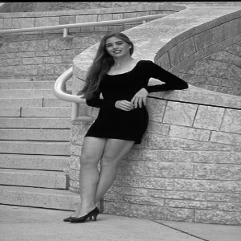
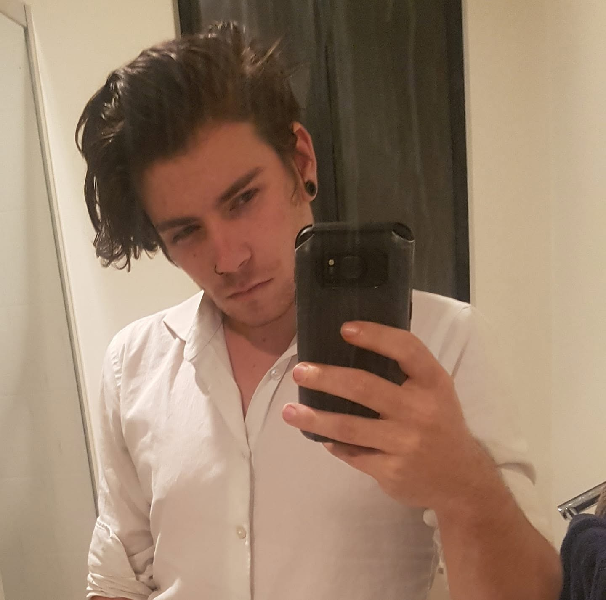
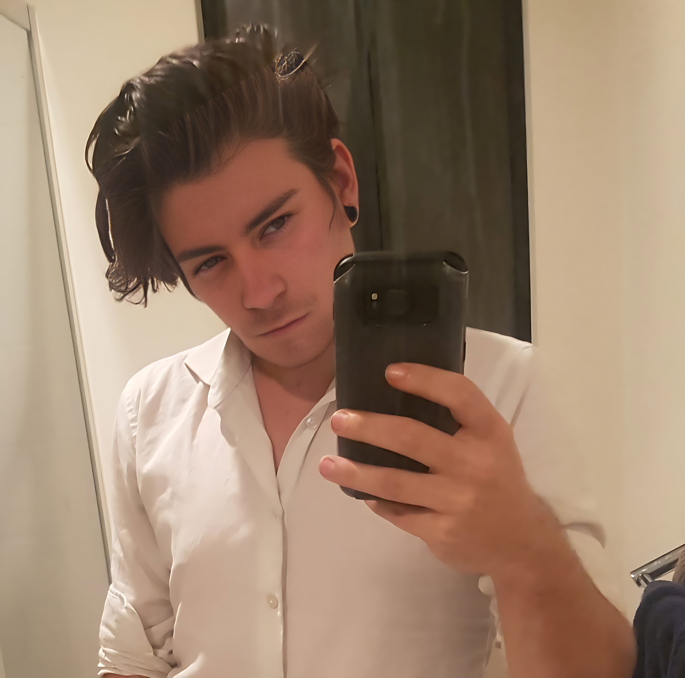
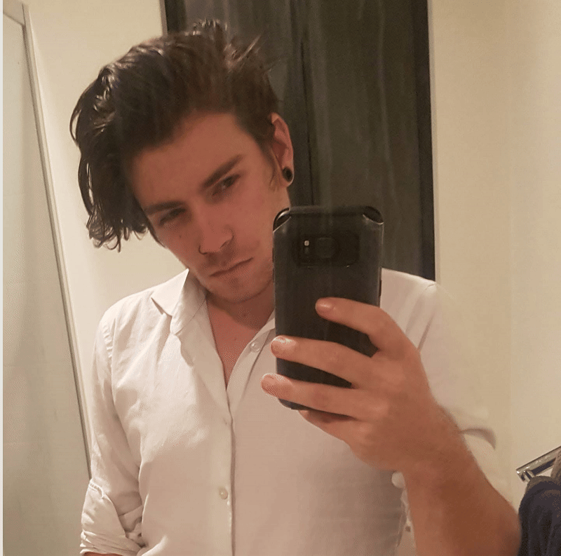
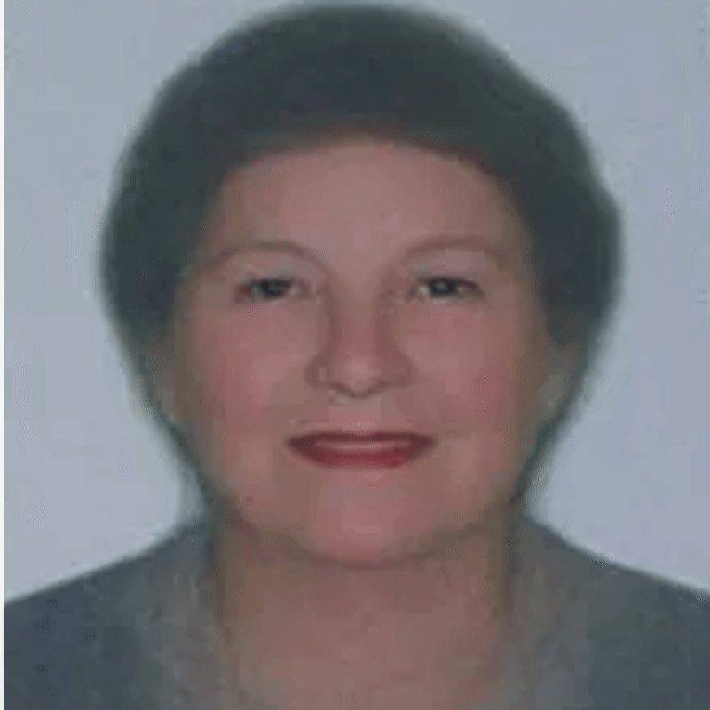
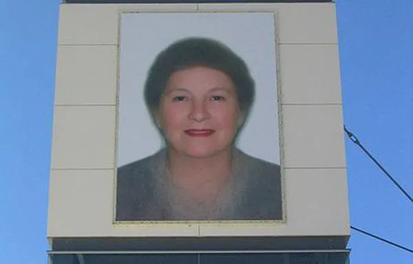
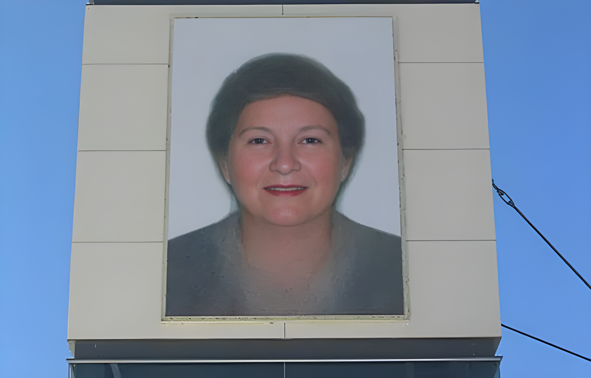
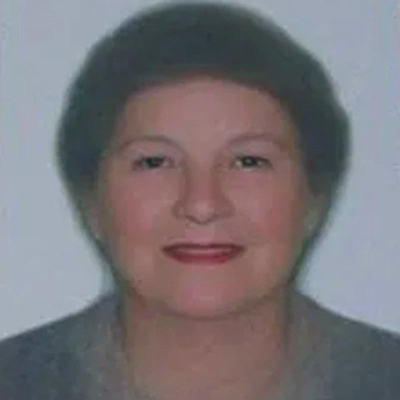
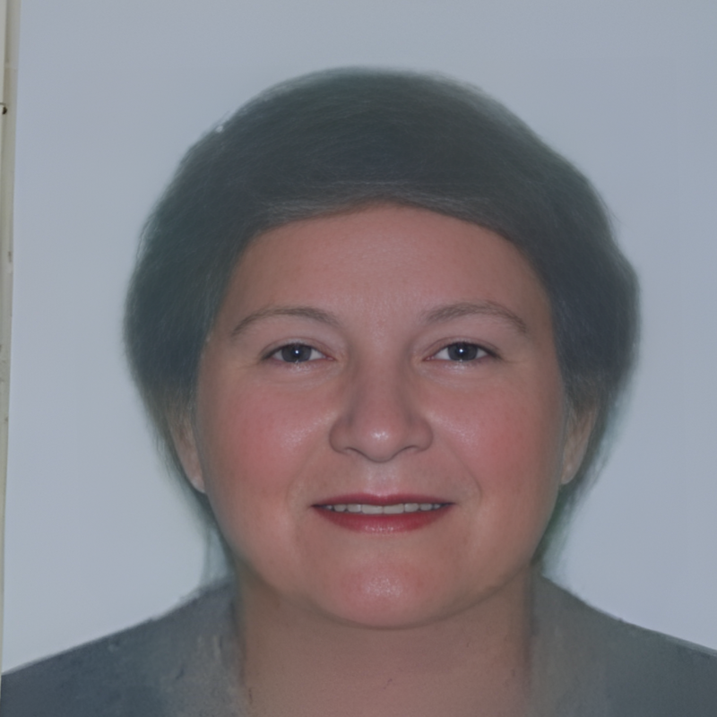

# SceneLift

AI background removal for creators and streamers.

SceneLift helps you isolate yourself from your background with a local CLI that works on:

- live webcam input for OBS and streaming
- image files, video files, or folders of frames
- transparent PNGs or rendered video output
- virtual camera loopback output when `pyvirtualcam` is installed

The primary CLI is still `bgremoval`; `bgremove` remains available as a compatibility alias.

## Why SceneLift

- Built for people who want a clean camera feed without wrestling with machine-learning jargon.
- Focused on low-latency live use, especially for OBS and streaming setups.
- Works with local files and local cameras, so you can keep the workflow simple and private.
- Preserves the existing CLI and Python API for people already using the project.

## Install

```bash
pip install -e .
pip install -e ".[ai,virtualcam]"
pip install -e ".[hf]"
```

# RealESRGAN Integration

## Examples

| Before                                               | After                                              |
| ---------------------------------------------------- | -------------------------------------------------- |
|  |  |


<!--
|                                                      | Before                                             | After |
| ---------------------------------------------------- | -------------------------------------------------- |
|  |  |

 -->



| Before                                                                   | After                                                           |
| ------------------------------------------------------------------------ | --------------------------------------------------------------- |
|                     |              |
|         |  |

<!--
<table>
  <tr>
    <th width="50%">Before</th>
    <th width="50%">After</th>
  </tr>
  <tr>
    <td width="50%">
      
    </td>
    <td width="50%">
      
    </td>
  </tr>
</table> -->


## Quick Start

If you just want the simplest live path for OBS:

```bash
bgremoval --input camera:0 --output virtualcam --method modnet --live --live-max-dimension 960
```

If you want a higher-quality live path and already have the TensorRT engine:

```bash
bgremoval --input camera:0 --output virtualcam --method ben2 --live --live-max-dimension 960
```

If you want a transparent image for overlays, thumbnails, or editing:

```bash
bgremoval --input samples/person.jpg --output out.png --method grabcut
```

If you want Real-ESRGAN upscaling, use the dedicated command family:

```bash
bgremoval-upscale --input input/photo.jpg --output output/photo-upscaled.png
```

## Examples

Process an image file to a transparent PNG:

```bash
bgremoval --input samples/person.jpg --output out.png --method grabcut
```

Process a folder of image frames into another folder:

```bash
bgremoval --input input/frames --output output/frames/modnet-trt --method modnet-trt --engine-path src/bgremoval/models/weights/modnet/modnet.engine
```

Process a video file to another video file:

```bash
bgremoval --input samples/input.mp4 --output out.mp4 --method rembg
```

Use webcam `0` as input and send to a loopback camera:

```bash
bgremoval --input camera:0 --output virtualcam --method birefnet --live
```

Live mode keeps only the newest frame and is the recommended path for OBS:

```bash
bgremoval --input camera:0 --output virtualcam --method birefnet --live --live-max-dimension 960
```

Run the TensorRT webcam paths through the same live pipeline:

```bash
bgremoval --input camera:0 --output virtualcam --method modnet --live --live-max-dimension 960
bgremoval --input camera:0 --output virtualcam --method ben2 --live --live-max-dimension 960
```

`modnet` and `ben2` are shorthand aliases for `modnet-trt` and `ben2-trt`. If you want to point at a specific TensorRT engine, use the full model key with `--engine-path`, `--width`, and `--height`:

```bash
bgremoval --input camera:0 --output virtualcam --method modnet-trt --engine-path src/bgremoval/models/weights/modnet/modnet.engine --width 512 --height 512 --live
bgremoval --input camera:0 --output virtualcam --method ben2-trt --engine-path src/bgremoval/models/weights/ben2/ben2.engine --width 1024 --height 1024 --live
```

For direct v4l2loopback or SRT output, use the model-specific runtimes:

```bash
modnet-run --engine-path src/bgremoval/models/weights/modnet/modnet.engine --mode loopback
ben2-run --mode loopback
```

Run a specific TensorRT engine through the top-level CLI:

```bash
bgremoval --input input/tam.mp4 --output output/tam-modnet.mp4 --method modnet-trt --engine-path src/bgremoval/models/weights/modnet/modnet.engine
```

Override the TensorRT input size when the engine was built for a different square shape:

```bash
bgremoval --input input/a.webp --output output/a-ben2.webp --method ben2-trt --engine-path src/bgremoval/models/weights/ben2/ben2-768.engine --width 768 --height 768
```

Benchmark the available backends on the same input frame:

```bash
bgremoval-benchmark --input input/a.webp --methods modnet-trt,u2net-human-seg,mediapipe-selfie-segmentation,grabcut
```

Benchmark BEN2 at a few fixed shapes:

```bash
ben2-benchmark --input input/a.webp
```

Build all BEN2 shapes in one pass:

```bash
ben2-build-all
```

Build the default TensorRT engine set in one pass:

```bash
bgremoval-trt-build-all
```

Build the default INT8 TensorRT engine set in one pass:

```bash
bgremoval-trt-build-int8 --calibration-data-dir input/calibration
```

Split a video into a folder of frames:

```bash
bgremoval-extract-frames --input input/tam.mp4 --output-dir frames --format webp
```

Prepare a calibration set from a folder of frames or sample images:

```bash
bgremoval-calibration-set --input-dir frames --output-dir input/calibration/modnet --max-samples 32
```

Pull all registry-backed model assets into the local weights tree, including the
official Real-ESRGAN release weights we mirror automatically:

```bash
bgremoval-model-pull-all
```

Run a startup healthcheck for one backend:

```bash
bgremoval-healthcheck --input input/a.webp --method mediapipe-selfie-segmentation
```

## For Creators And Streamers

SceneLift is designed to make background removal feel like part of a normal creative workflow:

- use it as a local virtual camera in OBS
- switch between fast, balanced, and quality-oriented backends
- process webcam feeds, recorded footage, or frame folders
- generate transparent cutouts for scenes, thumbnails, and edits

For the most approachable live setup, start with `modnet-trt` or `ben2-trt` and keep `--live` enabled.

## Notes

- `grabcut` works out of the box and is a useful baseline.
- `rembg` is the AI-backed path and becomes available after installing the optional extra.
- `birefnet` loads `ZhengPeng7/BiRefNet` from Hugging Face with `transformers`, `einops`, `kornia`, `timm`, and `torchvision`.
- `birefnet-export` converts a local BiRefNet `.pth` checkpoint to ONNX using the shared exporter framework under `src/bgremoval/models/exporters/`.
- `bgremoval-upscale`, `bgremoval-upscale-benchmark`, and `bgremoval-upscale-healthcheck` provide the Real-ESRGAN command framework.
- Install that backend with `pip install -e '.[upscale]'`.
- For live OBS-style output, `--virtualcam-no-sleep` can increase throughput by letting the pipeline run as fast as inference allows.
- The live camera path uses a one-frame queue so capture stays ahead of inference and drops stale frames instead of backing up.
- `u2net-human-seg` downloads `onnx/model.onnx` and `preprocessor_config.json` from `BritishWerewolf/U-2-Net-Human-Seg` and runs them through ONNXRuntime.
- `mediapipe-selfie-segmentation` downloads `onnx/model.onnx` and `preprocessor_config.json` from `onnx-community/mediapipe_selfie_segmentation` and runs them through ONNXRuntime.
- `modnet-trt` is the TensorRT-backed live path for MODNet-style webcam removal. The CLI also accepts `--method modnet` as a shorthand alias.
- `ben2-trt` is the BEN2 ONNX/TensorRT scaffold registered from `onnx-community/BEN2-ONNX`. The CLI also accepts `--method ben2` as a shorthand alias.
- For OBS, prefer `bgremoval --input camera:0 --output virtualcam --live` with `--method modnet` or `--method ben2`.
- `bgremoval` accepts `--engine-path`, `--width`, and `--height` for `modnet-trt` and `ben2-trt`. The optional `--mode live` flag is a shortcut for the existing live virtualcam path.
- `virtualcam` output requires `pyvirtualcam` plus a system virtual camera backend.
- `--live` enables the low-latency webcam pipeline with frame dropping and resolution control.
- Backends may run at a smaller internal inference size; the CLI resizes their RGBA output back to the input frame size before writing.
- With `--log-level DEBUG`, the CLI logs when backend output is resized to match the source frame.
- Logging supports console output, `--log-file`, and `--log-json`.
- Benchmarking and healthcheck commands share the same structured logging.
- `bgremoval-extract-frames` writes sequentially numbered `frame_000000.png` or `.webp` files to a target directory.
- `bgremoval-calibration-set` copies a representative subset of image files into a dedicated calibration directory for TensorRT INT8 builds.
- `bgremoval-model-pull-all` downloads every registry-backed model asset into `src/bgremoval/models/weights/`, plus the Real-ESRGAN checkpoints that have explicit release URLs.
- `bgremoval` can also process a directory of image frames directly and writes `.png` outputs into a target directory. See [`docs/directory-inputs.md`](/mnt/code/ai/background-removal/ben/docs/directory-inputs.md).
- `ben2-benchmark` compares the default BEN2 square shapes `1024`, `768`, and `512` and builds missing engines on demand.
- `ben2-build-all` builds the default BEN2 shape set in one pass and reuses a shared timing-cache file between shapes.
- `bgremoval-trt-build-all` runs the default MODNet build plus the BEN2 build-all set for first-time TensorRT setup. See [`docs/tensorrt-engine-builds.md`](/mnt/code/ai/background-removal/ben/docs/tensorrt-engine-builds.md).
- `bgremoval-trt-build-int8` builds the default MODNet INT8 engine and the BEN2 INT8 shape set in one pass. See [`docs/int8-quantization.md`](/mnt/code/ai/background-removal/ben/docs/int8-quantization.md).
- Extra flags passed to `bgremoval-trt-build-all` are forwarded to `modnet-build`, so you can override the MODNet ONNX or engine paths without skipping the BEN2 setup.
- `modnet-build` and `ben2-build` accept `--cache-dir` for timing-cache reuse without managing individual cache file paths.
- The model registry lives under `src/bgremoval/models/` and is the place to add new AI backends and their weights.
- All ONNX exporter implementations now live under `src/bgremoval/models/exporters/`; older paths remain as shims for compatibility.
- MODNet TensorRT now uses `Xenova/modnet` as the ONNX source; use `modnet-fetch` before `modnet-build`.
- `modnet-build` will auto-fetch the Xenova ONNX file if it is missing unless you disable that with `--no-auto-fetch-onnx`.
- `ben2-build` will auto-fetch `onnx-community/BEN2-ONNX` when the ONNX file is missing.
- TensorRT INT8 is available for `modnet-trt` and `ben2-trt`; see [`docs/int8-quantization.md`](/mnt/code/ai/background-removal/ben/docs/int8-quantization.md) for the calibration workflow and cache layout.
- Real-ESRGAN upscaling commands live under [`docs/upscaling-realesrgan.md`](/mnt/code/ai/background-removal/ben/docs/upscaling-realesrgan.md).
- Canonical live backend: `modnet-trt` on TensorRT.
